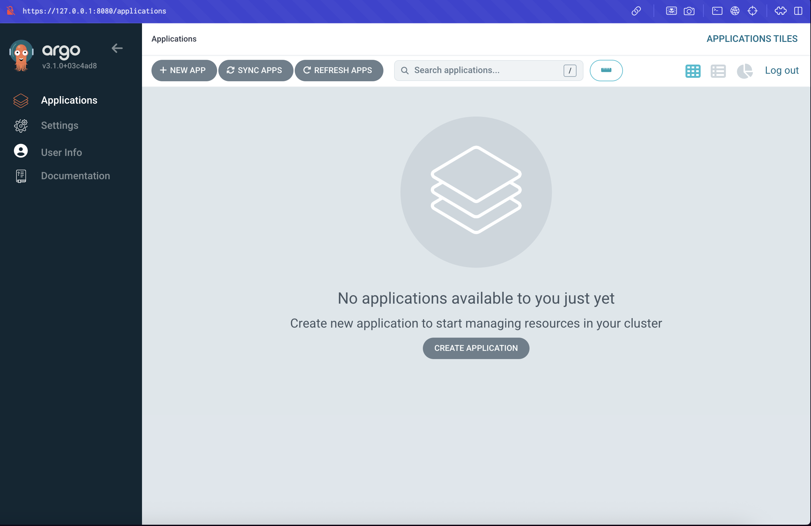
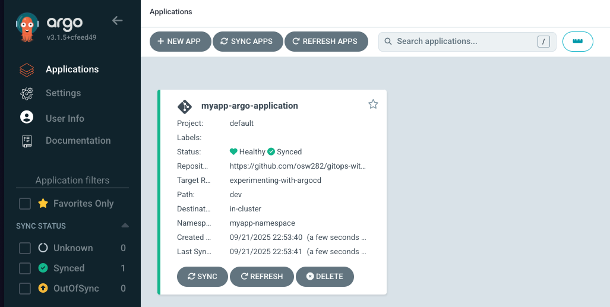

#  GitOps With ArgoCD 📈

In this demo, we'll use ArgoCD to implement the CD part of a CI/CD pipeline.

## 🧪 What You Will Learn

* How to install ArgoCD in K8s cluster
* Configure ArgoCD with "Application" CRD
* How to work with it going forward

## Getting Started

### Step 1 - Setup

Before we start this demo, clone my repository first, we will then create a new branch on the repository so that everything we do will not affect the main repo. Let's go ahead and do that:

```bash
git checkout -b experimenting-with-argocd
git push --set-upstream origin experimenting-with-argocd
```

### Step 2 - Minikube

We'll use Minikube as our local Kubernetes. If you don't have it installed yet, follow the instructions on the [Minikube start page](https://minikube.sigs.k8s.io/docs/start/?arch=%2Fmacos%2Farm64%2Fstable%2Fbinary+download); it should be straightforward.

> Note: you will need docker daemon running

Start the cluster:

```bash
minikube start
```

Verify the cluster is running:

```bash
minikube status
```

You should see something like this:


### Step 3 - ArgoCD

We will go ahead and install ArgoCD in our cluster by running the following commands:

```bash
kubectl create namespace argocd
kubectl apply -n argocd -f https://raw.githubusercontent.com/argoproj/argo-cd/stable/manifests/install.yaml
```

Alternatively, you can find more information in their [Getting Started](https://argo-cd.readthedocs.io/en/stable/getting_started/).

You should see a bunch of components being created with the commands above.

Now if we run:

```bash
kubectl get pod -n argocd
```

We should see a bunch of pods created or being created.


A good feature ArgoCD has is a UI that helps visualise our cluster. The UI is accessible via the `argocd-server` service.

Let's `kubectl port-forward` to access the UI locally.

```bash
kubectl port-forward -n argocd svc/argocd-server 8080:443
```

This is what you should see.


and now if you visit [https://127.0.0.1:8080/](https://127.0.0.1:8080/), your browser may warn that the connection is not private. It's safe — just proceed and you should see the UI login page.

The username is: `admin`.

To get the password, run the following command:
```bash
kubectl get secret argocd-initial-admin-secret -n argocd -o yaml
```

We should see the following:


The password is base64-encoded and we need to decode it. Copy the password from the terminal and run

```bash
echo <the-password> | base64 --decode
```

NOTE: Ignore the % sign.

You can now log in to the UI. You should see:



### Step 4 - Configure the ArgoCD Agent

You'll notice the UI is currently empty — there are no applications yet because we first need to configure it.

We'll add a YAML configuration in this repo for ArgoCD to track.

In the [dev](./dev/) folder, you'll find three YAML files: [deployment.yaml](./dev/deployment.yaml), [service.yaml](./dev/service.yaml), and [application.yaml](./dev/application.yaml).

The [application.yaml](./dev/application.yaml) file is the ArgoCD configuration. Let's go through it line by line to see what it does.

```yaml
apiVersion: argoproj.io/v1alpha1 # Required K8s field. For custom components like ArgoCD, the API version comes from the project.
kind: Application # It's a CRD called Application.
metadata:
  name: myapp-argo-application # Name of the ArgoCD Application
  namespace: argocd # Namespace to create the component in
spec:
  project: default # Every application belongs to a single project

  source:
    repoURL: https://github.com/osw282/gitops-with-argocd.git # Git repo ArgoCD will connect to and sync from
    targetRevision: experimenting-with-argocd # Branch to sync from (could be prod/staging/dev in a real project)
    path: dev # Where to look in the repo; everything here will be applied to the cluster
  destination:
    server: https://kubernetes.default.svc # Destination cluster address. Since ArgoCD runs inside the destination cluster, we can use the internal K8s API server name.
    namespace: myapp-namespace # Namespace where these resources will be created

  syncPolicy:
    syncOptions:
      - CreateNamespace=true # Create the namespace if it doesn't exist
    automated:
      prune: true
      selfHeal: true # Automatically undo and overwrite manual changes made directly to the cluster (e.g., kubectl apply)
```
### Working with a Private Repository (My repo is public, but just to show you)

There are a few ways to let ArgoCD access a private GitHub repo.
1. Connecting via the dashboard
2. [Using the ArgoCD cli](https://argo-cd.readthedocs.io/en/stable/user-guide/private-repositories/)
3. [Declarative approach]()

For this recipe, we will go with the dashboard approach. On the left side of the UI, you should find the settings tab.


Click `Repositories` and then `Connect Repo`.

.

Choose HTTPS as the connection method.


Repository URL would be our github repo in this case: `https://github.com/osw282/gitops-with-argocd.git`

The username is your github username and the password would be your PAT token with read access to the repo. (You only need them if the repository is private)

Press Connect and this is what we should see.


For an overview of all supported methods, see the [Argo CD private repositories guide](https://argo-cd.readthedocs.io/en/stable/user-guide/private-repositories/#credentials).

There are also multiple ways to manage secrets in Argo CD (see the [secret management docs](https://argo-cd.readthedocs.io/en/stable/operator-manual/secret-management/#destination-cluster-secret-management)).

👉 A simple and secure place to start is with a **dedicated deploy key** for your repository.

#### More Advanced Setups
- (Good) **Sealed Secrets:** [Example discussion](https://github.com/argoproj/argo-cd/discussions/5133#discussioncomment-368837), [Guide](https://blog.techwithhuz.com/how-argocd-and-sealed-secret-works#heading-sealed-secrets-with-argocd)
- **External Secrets Operator:** [Step-by-step guide](https://rderik.com/blog/setting-up-access-to-a-private-repository-in-argocd-with-ssm-parameter-store-and-external-secrets-operator/)


### Step 5 - Apply the Config

To get ArgoCD to start monitoring changes from our target repository/branch, apply [application.yaml](./dev/application.yaml):

From the root of the repo, run:
```bash
kubectl apply -f dev/application.yaml
```

This should be the only time we will need to run `kubectl apply` ourselves.

If we go back to our dashboard now, we should see our hello world app after ArgoCD has synced.

This step essentially sets up the ArgoCD agent that will monitor for target changes.

If we go back to the UI now, we should see our hello world application running.




To see the app, port-forward:

```bash
kubectl port-forward svc/myapp-service -n myapp-namespace 8081:8080
```

Visiting [http://127.0.0.1:8081/](http://127.0.0.1:8081/) to see it.

### That's It

That's pretty much it. ArgoCD will now monitor any changes we make to the repository. To test that, let's change our deployment from the hello world app to an Nginx server.

Replace the [deployment.yaml](./dev/deployment.yaml) with the following:

```yaml
apiVersion: apps/v1
kind: Deployment
metadata:
  name: myapp
spec:
  selector:
    matchLabels:
      app: myapp
  replicas: 2
  template:
    metadata:
      labels:
        app: myapp
    spec:
      containers:
      - name: myapp
        image: nginx:alpine
        ports:
        - containerPort: 80
```

and update [service.yaml](./dev/service.yaml) to:

```yaml
apiVersion: v1
kind: Service
metadata:
  name: myapp-service
spec:
  selector:
    app: myapp
  ports:
  - port: 8080
    protocol: TCP
    targetPort: 80
```

Commit these changes to our remote branch:

```bash
git add dev/deployment.yaml
git add dev/service.yaml
git commit -m "Update images from hello world to nginx"
git push
```

In the UI, you should see two replicas for the Nginx application, and the hello world pods should be pruned. Try clicking refresh if these don't show up.


Port-forward again to view it:
```bash
kubectl port-forward svc/myapp-service -n myapp-namespace 8081:8080  
```

If we visit [http://127.0.0.1:8081/](http://127.0.0.1:8081/) now, we should see:


That's it.

### Clean Up

To shut down our cluster:

```bash
minikube delete --all
```

Finally, delete the github branch we created.